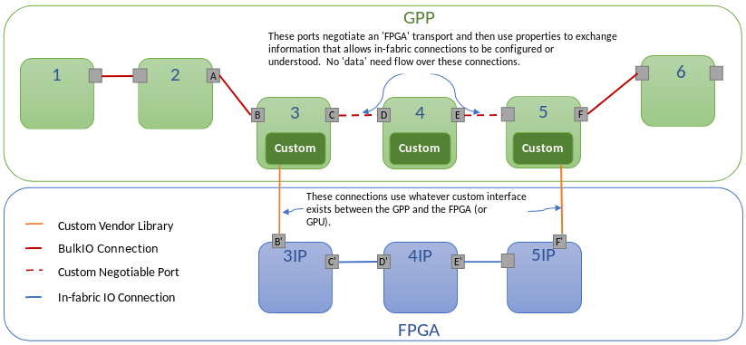

# Creating Connections between Components in FPGA

In the context of REDHAWK, a component's implementation is not solely tied to a single process or thread running on a microprocessor. Its main functionality could be targeted for an FPGA. In the case of a single component running on an FPGA, the role of the component is to manage the bitfile load, provide command-and-control information to the embedded device, and perform data ingress and egress to and from embedded hardware.  In the case where multiple components are targeted for the same FPGA, the role of the components is to manage their FPGA loads, provide command-and-control information to their respective processing elements, and manage data ingress and egress to the embedded hardware's endpoints.  Connections, data ingress, and data egress between components on the FPGA can be managed using a custom transport layer for a REDHAWK BulkIO port. The following image displays multiple components targeted for the same FPGA.



BulkIO allows for the addition of transports beyond those included by default. These transports are selected based on a priority, with CORBA's priority set to 99 and shared memory IPC set to 1; in the case of communications between components in the same process, a local transport is selected, which is defined as shared address space. In the following code examples, the first example demonstrates how a new transport is created and applied to links between components running in different processes. The second code example demonstrates how to subclass a BulkIO port and change the local transport to a custom one.

Note: The custom transport is designed to interact with other BulkIO ports. If out-of-band communications as well as traditional microprocessor-based communications are supported in component, then data needs to be transferred both out-of-band and using the stream API in the microprocessor code. This option is impractical, but is necessary if the BulkIO port is meant to support communications with other ports supporting the custom transport as well as traditional microprocessor-based software.

## Adding Transports to BulkIO

In this example, a component called `transport_out` has a single output `dataFloat` port (called `dataFloat_out`) and another component called `transport_in` that has a single input `dataFloat` port (called `dataFloat_in`). This example demonstrates how to modify these components such that the data exchange occurs outside the scope of the built-in BulkIO mechanisms, as is required when the BulkIO connection is between software on a GPP and firmware on an FPGA.

The following pattern is implemented in both the out (uses) and in (provides) side: create a transport factory, which in turn is used to create a transport manager, which in turn creates the transport itself. The transport factory is instantiated globally, the transport manager is instantiated per port, and the transport is instantiated per connection. The BulkIO base classes exercise this pattern.

In this pattern, the transport factories register statically with a transport registry. This transport registry contains all the transports that are supported. At transport negotiation time, the transport names are matched in order of their priority, from the lowest number to the highest. In this example, the "custom" transport is given a priority of 0, making it the highest priority transport, guaranteeing that it will be selected if the transport is supported by both ends of the transaction.

Once a matching transport has been selected, an exchange of properties is performed. The output side implements `getNegotiationProperties` to provide transport information to the input side. The input side receives these properties in its `createInputTransport` function. The response properties from the input side are retrieved through the input side's `getNegotiationProperties` function. Once the output side receives the response from the input side, the response is passed to the port through the `setNegotiationResult` function.

In the following example, the properties included are examples only and do not need to be included in the actual implementation.

Several `log` statements are included in this code to demonstrate where in the connection process these functions are invoked. These are the locations where device-specific customizations are meant to occur.

Ideally, the transport definition would be developed in a library and linked into the component, like a soft package dependency. However, for the sake of simplicity, in this example, the transport definition is added as source to both components.

### Component Edits

In each component, two files need to be modified: the component's user header and cpp files,  `transport_out.h/transport_out.cpp` and `transport_in.h/transport_in.cpp` for `transport_out` and `transport_in`, respectively.

Modify `transport_in.h` and `transport_out.h` to include the following class declarations:

```cpp
     #include <ossie/debug.h>
     #include <ossie/ProvidesPort.h>
     #include <ossie/UsesPort.h>
     #include <BulkioTransport.h>


    // class implementing the custom input transport
    class CustomInputTransport : public bulkio::InputTransport<BULKIO::dataFloat>
    {
    public:

        CustomInputTransport(bulkio::InPort<BULKIO::dataFloat>* port,
                             const std::string& transportId,
                             const redhawk::PropertyMap &usesTransportProps )
          : bulkio::InputTransport<BULKIO::dataFloat>(port, transportId) {

          // save off source end point description
          _usesTransportProps = usesTransportProps;
        };

        virtual ~CustomInputTransport() {
           RH_NL_INFO("custom.transport", "CustomInputTransport::~CustomInputTransport" );
        }

        std::string transportType() const {
             return "custom";
        };

        redhawk::PropertyMap    getNegotiationProperties();

        /**
          Control interface used by port when a connectPort occurs to start the transport after the negotiation has completed.
         */
        void startTransport() {
           RH_NL_INFO("custom.transport", "CustomInputTransport::startTransport");
        };

        /**
          Control interface used by port when a disconnectPort occurs to stop the transport.
         */
        void stopTransport() {
           RH_NL_INFO("custom.transport", "CustomInputTransport::stopTransport");
        };

        protected:
          //  provides transport layer statistics to port
          redhawk::PropertyMap  _getExtendedStatistics() {
              return redhawk::PropertyMap();
          }

        private:
           redhawk::PropertyMap     _usesTransportProps;
    };

    // class implementing the custom output transport
    class CustomOutputTransport : public bulkio::OutputTransport<BULKIO::dataFloat>
    {
    public:

        CustomOutputTransport(bulkio::OutPort<BULKIO::dataFloat>* parent,
                              BULKIO::dataFloat_ptr port,
                              const std::string& connectionId,
                              const redhawk::PropertyMap &props )
          : bulkio::OutputTransport<BULKIO::dataFloat>(parent, port) {
            _connectionId = connectionId;
            _inProps = props;
        };

        virtual ~CustomOutputTransport() {
           RH_NL_INFO("custom.transport", "CustomOutputTransport::~CustomOutputTransport" );
        };

        std::string transportType() const {
            return "custom";
        };

        virtual CF::Properties transportInfo() const {
            redhawk::PropertyMap props;
            props["transport_side_information"] = "outbound";
            props["another_number"] = static_cast<short>(100);
            return props;
        };

        void _pushSRI(const BULKIO::StreamSRI& sri) {};
        void _pushPacket(const BufferType& data, const BULKIO::PrecisionUTCTime& T, bool EOS, const std::string& streamID) {};

        void disconnect() {
            RH_NL_INFO("custom.transport", "CustomOutputTransport::disconnect" );
            // perform disconnection
        };

        redhawk::PropertyMap  getNegotiationProperties();

    protected:
        std::string _connectionId;
        redhawk::PropertyMap  _inProps;
    };

    // manager class that creates input transport layer for a negotiable port
    class CustomInputManager : public bulkio::InputManager<BULKIO::dataFloat>
    {
    public:

        CustomInputManager(bulkio::InPort<BULKIO::dataFloat>* port)
          : bulkio::InputManager<BULKIO::dataFloat>(port) {
        };

        virtual ~CustomInputManager() {
        };

        CustomInputTransport* createInputTransport(const std::string& transportId, const redhawk::PropertyMap& properties) {
            RH_NL_INFO("custom.transport", "CustomInputManager::createInputTransport" );
            for ( redhawk::PropertyMap::const_iterator it = properties.begin(); it != properties.end(); it++) {
                 RH_NL_INFO("custom.transport", "CustomInputManager, key (from uses): "<<it->id );
            }
            return new CustomInputTransport(this->_port, transportId, properties);
        };

        std::string transportType(){
            return "custom";
        };

        redhawk::PropertyMap getNegotiationProperties(redhawk::ProvidesTransport* providesTransport);

    };

    // manager class that creates output transport layer for a negotiable port
    class CustomOutputManager : public bulkio::OutputManager<BULKIO::dataFloat>
    {
    public:

        CustomOutputManager(bulkio::OutPort<BULKIO::dataFloat>* port)
          : bulkio::OutputManager<BULKIO::dataFloat>(port) {};

        virtual ~CustomOutputManager() {};

        std::string transportType() {
                return "custom";
        }

        virtual CF::Properties transportProperties();
        virtual CustomOutputTransport* createOutputTransport(PtrType object, const std::string& connectionId, const redhawk::PropertyMap& properties);
        virtual redhawk::PropertyMap getNegotiationProperties(redhawk::UsesTransport* transport);
        virtual void setNegotiationResult(redhawk::UsesTransport* transport, const redhawk::PropertyMap& properties);
    };

    // factory class that registers input/ouptut managers with a negotiation port
    class CustomTransportFactory : public bulkio::BulkioTransportFactory<BULKIO::dataFloat>
    {
    public:

        std::string transportType() {
            return "custom";
        };

        int defaultPriority() {
            return 0;
        };

        virtual ~CustomTransportFactory() {};

        CustomOutputManager* createOutputManager(OutPortType* port);
        CustomInputManager* createInputManager(InPortType* port);
    };
```

Modify `transport_in.cpp` and `transport_out.cpp` to define these functions:

```cpp

    redhawk::PropertyMap CustomInputTransport::getNegotiationProperties() {
        RH_NL_INFO("custom.transport", "CustomInputTransport::getNegotiationProperties");
        redhawk::PropertyMap props;
        props["data::requestSize"] = static_cast<CORBA::Long>(1000);
        props["data::address"] = "0.0.0.0";
        props["data::port"] =  static_cast<CORBA::Long>(0);
        props["data::protocol"] = "udp";
        return props;
    }

    redhawk::PropertyMap CustomInputManager::getNegotiationProperties(redhawk::ProvidesTransport* providesTransport)
    {
        CustomInputTransport* _transport = dynamic_cast<CustomInputTransport*>(providesTransport);
        if (!_transport) {
            throw redhawk::FatalTransportError("Invalid provides transport instance");
        }

        // return data end point connection information
        redhawk::PropertyMap properties;
        properties =  _transport->getNegotiationProperties();
        return properties;
    }

    CustomInputManager* CustomTransportFactory::createInputManager(bulkio::InPort<BULKIO::dataFloat>* port) {
        return new CustomInputManager(port);
    }


    redhawk::PropertyMap CustomOutputTransport::getNegotiationProperties() {
        RH_NL_INFO("custom.transport", "CustomOutputTransport::getNegotiationProperties");
        redhawk::PropertyMap props;
        props["data_protocol"] = "hello";
        return props;
    }

    CF::Properties CustomOutputManager::transportProperties() {
        RH_NL_INFO("custom.transport", "CustomOutputManager::transportProperties");
        redhawk::PropertyMap props;
        return props;
    }

    CustomOutputTransport* CustomOutputManager::createOutputTransport(PtrType object,
                                                                      const std::string& connectionId,
                                                                      const redhawk::PropertyMap& inputTransportProps)
    {
        return new CustomOutputTransport(this->_port, object, connectionId, inputTransportProps );
    }

    redhawk::PropertyMap CustomOutputManager::getNegotiationProperties(redhawk::UsesTransport* transport) {
        CustomOutputTransport* _transport = dynamic_cast<CustomOutputTransport*>(transport);
        if (!_transport) {
            throw redhawk::FatalTransportError("Invalid transport object provided.");
        }

        redhawk::PropertyMap properties;
        properties =  _transport->getNegotiationProperties();
        return properties;
    }

    void CustomOutputManager::setNegotiationResult(redhawk::UsesTransport* transport, const redhawk::PropertyMap& properties) {

         if (!transport) {
             throw redhawk::FatalTransportError("Invalid transport object provided.");
         }

        RH_NL_INFO("custom.transport", "CustomOutputManager::setNegotiationResult");
        for ( redhawk::PropertyMap::const_iterator it = properties.begin(); it != properties.end(); it++) {
              RH_NL_INFO("custom.transport",  "CustomOutputManager, key (from provides): "<<it->id );
        }
    }

    CustomOutputManager* CustomTransportFactory::createOutputManager(OutPortType* port)
    {
        return new CustomOutputManager(port);
    };
```

Modify `transport_in.cpp` and `transport_out.cpp` to register the transport:

```cpp
    static int initializeModule() {
        static CustomTransportFactory factory;
        redhawk::TransportRegistry::RegisterTransport(&factory);
        return 0;
    }

    static int initialized = initializeModule();
```

## Testing the New Transport

To test the previous code examples, compile and install both components (`transport_out` and `transport_in`).

The following Python session demonstrates how to run the components, connect them, and verify the state of the connections. (Note that `shared` is set to `False`, forcing the components to run in different process spaces.)

```python
    >>> from ossie.utils import sb
    >>> src=sb.launch('transport_out', shared=False)
    >>> snk=sb.launch('transport_in')
    >>> src.connect(snk)
    CustomOutputTransport::getNegotiationProperties
    CustomInputManager::createInputTransport
    CustomInputManager, key (from uses): data_protocol
    CustomInputTransport::startTransport
    CustomInputTransport::getNegotiationProperties
    CustomOutputManager::setNegotiationResult
    CustomOutputManager, key (from provides): data::requestSize
    CustomOutputManager, key (from provides): data::address
    CustomOutputManager, key (from provides): data::port
    CustomOutputManager, key (from provides): data::protocol
    >>> src.ports[0]._get_connectionStatus()
    [ossie.cf.ExtendedCF.ConnectionStatus(connectionId='DCE_66bd31e4-3cab-452b-8c21-6c3a2bc165eb', port=<bulkio.bulkioInterfaces.BULKIO.internal._objref_dataFloatExt object at 0x7f55d294f990>, alive=True, transportType='custom', transportInfo=[ossie.cf.CF.DataType(id='transport_side_information', value=CORBA.Any(CORBA.TC_string, 'outbound')), ossie.cf.CF.DataType(id='another_number', value=CORBA.Any(CORBA.TC_short, 100))])]
    >>> src.disconnect(snk)
    CustomOutputTransport::disconnect
    CustomInputTransport::~CustomInputTransport
    CustomOutputTransport::~CustomOutputTransport
```

## Overloading BulkIO Ports

Adding transports enables the developer to customize the transport mechanism beyond that provided by the REDHAWK baseline. One of the limitations of the transport mechanism addition is that if the two components are located in the same process space, the transport selection mechanism defaults to shared address space, which is optimal for threads located on the same process. However, there are instances in which this approach is not optimal. For example, some embedded hardware requires a single point of entry from the microprocessor, so all processing threads that require access to the embedded hardware through the driver must be placed in the same process space. In this case, it may be desirable for the embedded hardware resources to connect to each other directly even though the controlling software resides in two separate threads in the microprocessor. In such instances, it is necessary to overload the provided ports and change the behavior of the default transport mechanism for components that share address space.

For this example, assume that the components with the updated transport shown in the previous example are modified as described in the example. The only additional change is to overload the required ports to select the custom transport for shared address space components; in the case of transport definition, endpoints that share the same address space are considered local.

This example requires that the `\*\_base` files be modified on each of these components, so component re-generation for attributes like new properties is not possible while safeguarding these changes. Furthermore, the IDE has been updated to hide several of the CORBA base classes, so the `_remove_ref member` is shown as an error. To hide this error: In the Project Explorer view, right-click the project and select Properties->C/C++ General->Paths and Symbols->GNU C++, and add `HAVE_OMNIORB4` as a symbol (no value necessary).

Because the output port selects the transport to be used, the only port that must be overloaded is the output port, so only `transport_out` needs to be modified.

### Modifications to `transport_out_base.h`

Modifications to `transport_out_base.h` include a port declaration inherited from the BulkIO `OutFloatPort` base case. This new class redefines the behavior of the `_createLocalTransport` method to disable the local transport when both endpoints reside in the same process space.

Modify `transport_out_base.h` by adding the new port declaration:

```cpp
    class CustomOutPort : public bulkio::OutFloatPort {
    public:
            virtual ~CustomOutPort() {};
            CustomOutPort(std::string port_name)
              : bulkio::OutFloatPort(port_name) {};

            virtual redhawk::UsesTransport* _createLocalTransport(PortBase* port, CORBA::Object_ptr object, const std::string& connectionId);
    };
```

### Modifications to `transport_out_base.cpp`

In `transport_out_base.cpp`, the new port behavior needs to be defined and instantiated in place of the BulkIO base class port.

Add the following function definition in `transport_out_base.cpp`:

```cpp
    redhawk::UsesTransport* CustomOutPort::_createLocalTransport(PortBase* port, CORBA::Object_ptr object, const std::string& connectionId) {
        // disable the local transport and force a negotiation
        return 0;
    }
```

Change the following class instantiation in `transport_out_base.cpp` from:

```cpp
    dataFloat_out = new bulkio::OutFloatPort("dataFloat_out");
```

to:

```cpp
    dataFloat_out = new CustomOutPort("dataFloat_out");
```

## Testing the New Port

As in the previous example, compile and install `transport_out`, the only component modified for this example.

The following Python session demonstrates how to run the components, connect them, and verify the state of the connections. (Note that `shared` is not set to `False`; therefore, both components run in the same process space.)

```python
    >>> from ossie.utils import sb
    >>> src=sb.launch('transport_out')
    >>> snk=sb.launch('transport_in')
    >>> src.connect(snk)
    CustomOutputTransport::getNegotiationProperties
    CustomInputManager::createInputTransport
    CustomInputManager, key (from uses): data_protocol
    CustomInputTransport::startTransport
    CustomInputTransport::getNegotiationProperties
    CustomOutputManager::setNegotiationResult
    CustomOutputManager, key (from provides): data::requestSize
    CustomOutputManager, key (from provides): data::address
    CustomOutputManager, key (from provides): data::port
    CustomOutputManager, key (from provides): data::protocol
    >>> src.ports[0]._get_connectionStatus()
    [ossie.cf.ExtendedCF.ConnectionStatus(connectionId='DCE_66bd31e4-3cab-452b-8c21-6c3a2bc165eb', port=<bulkio.bulkioInterfaces.BULKIO.internal._objref_dataFloatExt object at 0x7f55d294f990>, alive=True, transportType='custom', transportInfo=[ossie.cf.CF.DataType(id='transport_side_information', value=CORBA.Any(CORBA.TC_string, 'outbound')), ossie.cf.CF.DataType(id='another_number', value=CORBA.Any(CORBA.TC_short, 100))])]
    >>> src.disconnect(snk)
    CustomOutputTransport::disconnect
    CustomInputTransport::~CustomInputTransport
    CustomOutputTransport::~CustomOutputTransport
```
