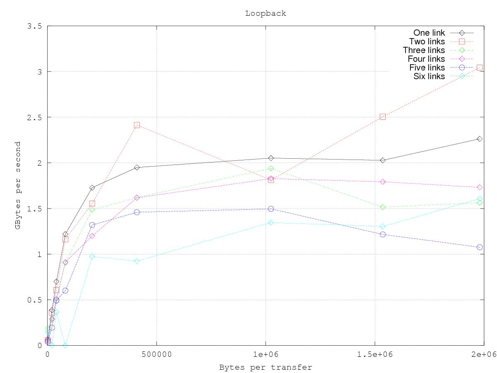
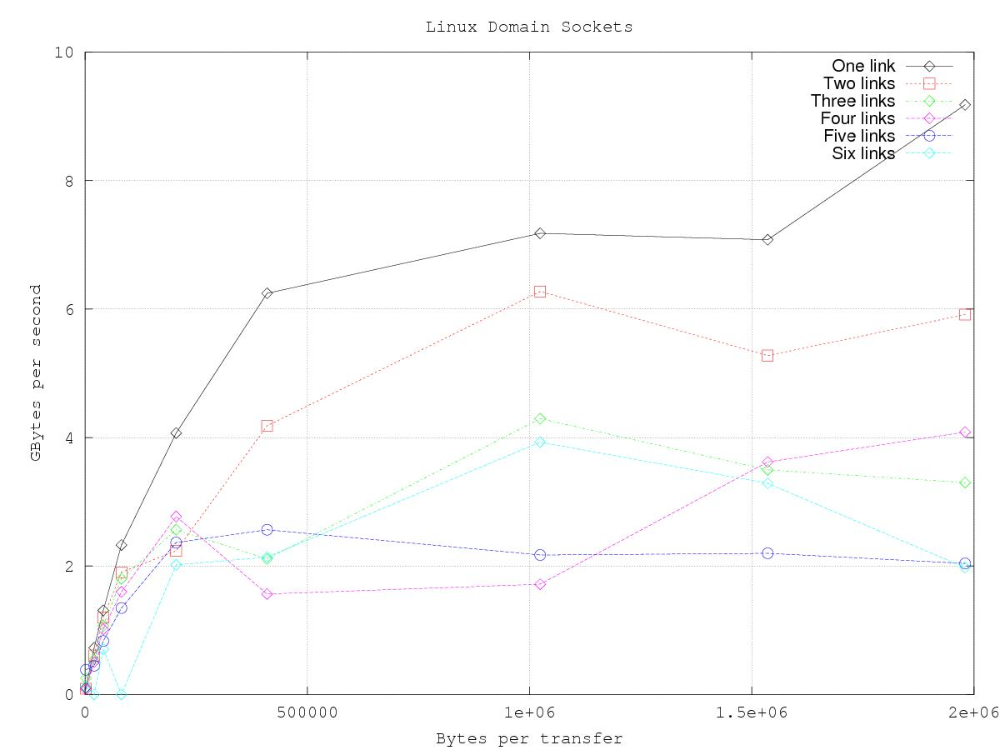
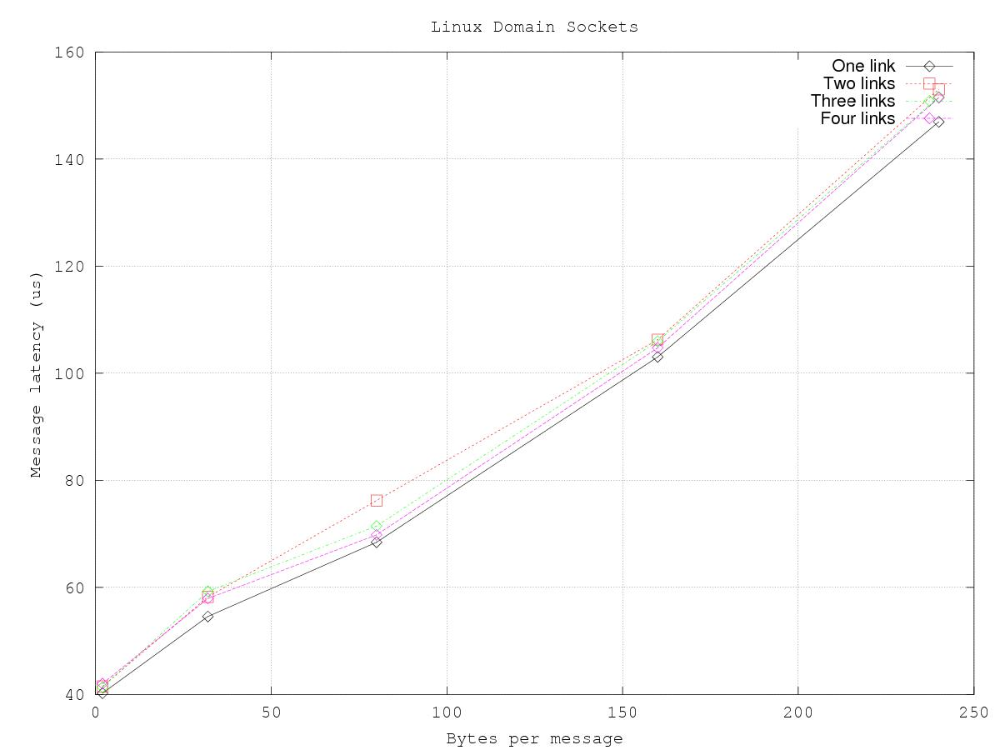

# Optimization

As a system framework, REDHAWK is affected by system settings beyond the scope of REDHAWK. System optimization is sensitive to the set of <abbr title="See Glossary.">applications</abbr> that the system is intended to support. However, there are some simple settings that can apply to a wide set of applications. This chapter describes some of the effects of these generalized settings.

## Configuring omniORB

By default, omniORB configuration relies on the loopback interface of the operating system. While easy to use and manage, the loopback interface is not the fastest default transport that omniORB supports. omniORB also supports Unix domain sockets. Unix domain sockets are configured through the omniORB configuration file (/etc/omniORB.cfg).

The following steps explain how to configure Unix domain sockets.

> **NOTE**  
> Root permissions are required to perform the following steps.  

1.  In the omiORB configuration file (/etc/omniORB.cfg), set the endpoints where the server is listening by adding the following lines to the endPoint section of the file:

    ```bash
    endPoint = giop:tcp:127.0.0.1:
             = giop:tcp:<computer IP address>:
             = giop:unix:
    ```

> **NOTE**  
> GIOP (General Inter-ORB Protocol) is the scheme used by the endpoint. TCP is the protocol followed by an IP address or host name. The port is specified after the last colon. Since no port is specified here, the operating system chooses the port. The Unix transport name uses a filename as the name of the socket in the filesystem. Since a name is not specified here, a name based on the process ID and timestamp is used.  

2.  Set the endpoints that are published in an object's Interoperable Object Reference (IOR) by adding the following lines to the endPointPublish section of the file:

    ```bash
    endPointPublish = all(addr)
    ```

    After changing these settings, the <abbr title="See Glossary.">naming</abbr> and <abbr title="See Glossary.">Event Services</abbr> must be reset, and their associated log files must be deleted. If the log files are not deleted, they preserve IORs that are no longer valid.

3.  Use the following command to reset the name and Event Services and delete the associated log files:

    ```bash
    sudo $OSSIEHOME/bin/cleanomni
    ```

    Run this script with the `-v` or `--verbose` option to print the cleanup process.

4.  To verify that Unix domain sockets are being used, go to /tmp, and verify that the omni-omni and omni-root directories exist. These two directories contain the files for the Unix domain sockets. Given that communications are now over file descriptors, verify that read permissions are open when communicating between objects owned by different users.
This change in the omniORB configuration greatly improves data transport rates.

## Packet Transfer Size

REDHAWK transfers data using Bulk Input/Output (BulkIO), which is an RPC mechanism. The size of the data sequence that is passed on each of these calls has an effect on the data rate. The size of the transfer is not controlled by the REDHAWK runtime environment; instead, data producers can pass any arbitrary length less than `giopMaxMsgSize`.

To demonstrate how throughput is affected by the configuration of omniORB and data transfer size, tests were performed on a system with the specifications shown below.

##### Computer Hosting Experiments
| **Parameter**   | **Value** |
| :-------------- | :-------- |
| Number of cores | 8         |
| CPU clock speed | 3.40 GHz  |
| Cache size      | 8192 kB   |


The figure below shows the supported data rate in Giga-bytes per second at different transfer sizes when using the loopback interface (the default setting for omniORB). Data rates on the experiment platform plateau when transfer size approaches approximately 500 kB. Using higher transfer sizes, data rate does not improve, while latency increases. The value at which data rates plateau is system-specific.


Another result derived from this experiment is that there is a substantial impact when the number of <abbr title="See Glossary.">component</abbr> pairs transferring data increases.

By following the steps in [Configuring omniORB](#configuring-omniorb), it is possible to achieve higher data rates. The following figure shows the same experiment as the one shown above, but with omniORB configured for Unix domain sockets. The sustained data rates on the computer used in this experiment are roughly four times higher when using Unix domain sockets compared to using the loopback interface. Even when heavily loaded, the Unix domain socket configuration is as fast or faster than the lightly-loaded loopback configuration.


## Messaging Latency

Much like BulkIO, messaging is subject to performance issues as the transfer size changes. Testing was performed to determine the impact of <abbr title="See Glossary.">message</abbr> size on the latency per message. The size of the message was modified and the latency per message was measured. The average latency was measured for sets of 1000 messages. The two figures below show the latency results when using the loopback interface and when using Unix domain sockets. Latency is a function of the size of the message, where the measured latency ranges between 40-150 microseconds and 50-160 microseconds for Unix domain sockets and loopback interface, respectively.



Note that in both figures latency is linear as a function of the message size. Furthermore, the number of concurrent messaging components has no discernible impact on the message latency. Finally, the difference shown between Unix domain socket performance and loopback interface performance is, while measurable, relatively small.
